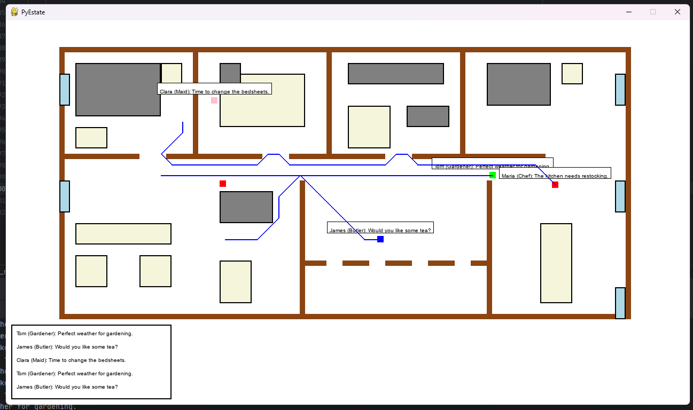

# PyEstate
Hello and welcome to my little AI side project :]
Note that this is just a prototype and does not with LLMs yet. Everything is simulate to look "real".

## What is this simulation?
The ideas is to play around with different technologies and be able to craft a simulation that is based on LLM reasoning.

Image taken during the prototyping.

### Ideas
- Use A-star algorithm for pathfinding within the Estate.
- Automatic unstuck mechanism for NPCs
- Use LLM reasoning to decided where to go and what to do.
- Add a tab for basic needs
- Add a tab for social thoughts
- Add equipment

## Note
I don't want to hide that I am getting plenty of help with this project from LLMs. Currently I am using
Claude which is great help for learning the complicated topics of path finding algorithms and make this
simulation work inside a pygame enviroment considering my limited free time. This project would not be possible
without the help.

I am just a man full of ideas and limtied time to make them come to life <3